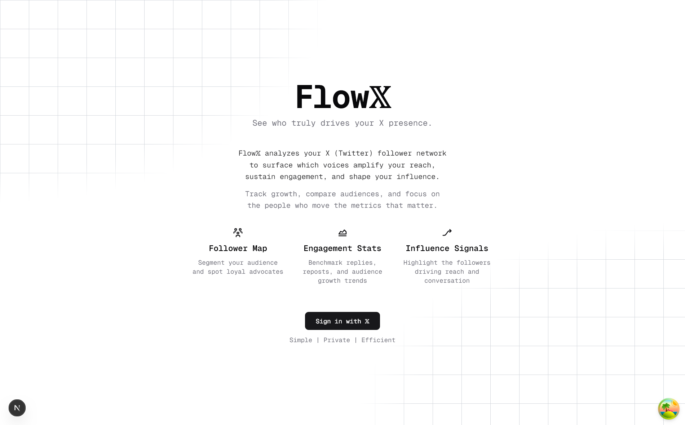
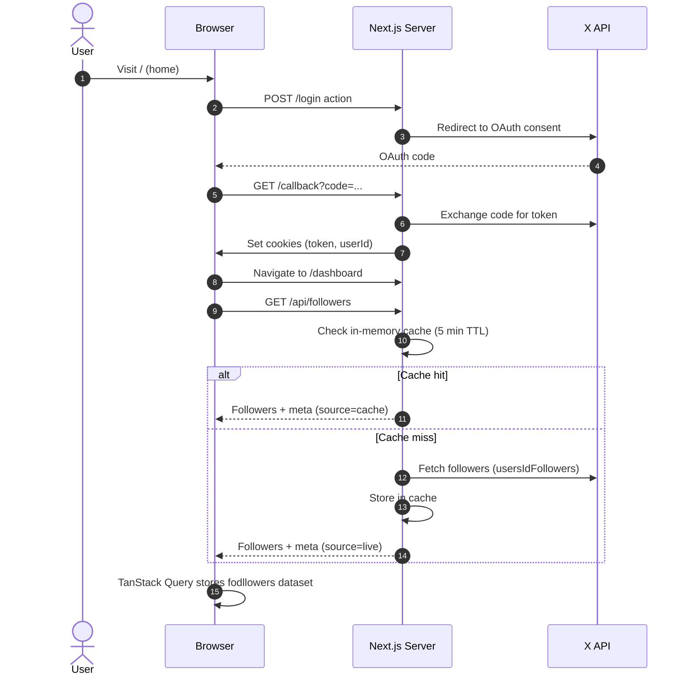

# Flow𝕏 — See Who Truly Drives Your X Presence



Flow𝕏 surfaces the X (Twitter) followers who amplify your reach, sustain engagement, and shape influence. The current milestone wires the full auth + data pipeline, caches follower data to stay within rate limits, and exposes a clean dashboard snapshot so future UI work can build on a reliable data layer.

## Highlights

- **OAuth flow with refresh support** using the official [twitter-api-sdk](https://github.com/twitterdev/twitter-api-typescript-sddk) and cookie-based token storage.
- **Server-side follower ingestion** (`app/api/followers/route.ts`) with five-minute in-memory caching keyed by user ID to avoid rate-limit thrash.
- **TanStack Query integration** in the dashboard so the followers dataset is instantly available client-side, including helpful metadata describing cache freshness.
- **Home + dashboard storytelling** aligned with the product tagline “see who truly drives your X presence,” ready for future insight visualizations.
- **Polished UI shell** powered by [Next.js App Router](https://nextjs.org/docs/app), [Tailwind CSS](https://tailwindcss.com), and [@tabler/icons-react](https://tabler.io/icons) for consistent visuals.

## Tech Stack

- [Next.js 14 App Router](https://nextjs.org/docs/app) with Edge-ready serverless routes
- [React 18](https://react.dev) + [TypeScript](https://www.typescriptlang.org)
- [@tanstack/react-query](https://tanstack.com/query/latest) for client-side caching & revalidation
- [twitter-api-sdk](https://github.com/twitterdev/twitter-api-typescript-sdk) for X API access
- [Tailwind CSS](https://tailwindcss.com) & [Geist Mono](https://vercel.com/fonts/geist) for styling
- [Bun](https://bun.sh) (optional) for fast local tooling

## System Overview



## Folder Guide

- `app/layout.tsx` — global metadata, font, and `QueryClientProvider` wiring
- `app/page.tsx` — marketing hero with refreshed messaging
- `app/callback/route.ts` — OAuth redirect handler, persists token cookie
- `app/dashboard/page.tsx` — dashboard shell, renders follower snapshot card
- `app/dashboard/followers-snapshot.tsx` — client component reading the TanStack Query cache
- `app/api/followers/route.ts` — cached follower endpoint with token refresh + cookie updates
- `lib/twitter.ts` — OAuth helpers, token utilities, and follower fetcher

## Getting Started

1. **Clone & install**

   ```bash
   bun install # or npm install / pnpm install / yarn
   ```

2. **Configure environment** — copy `.env.example` (if present) to `.env.local` and supply:

   ```bash
   X_CLIENT_ID="your client id"
   X_CLIENT_SECRET="your client secret"
   X_STATE_STRING="random-verifier"
   X_CODE_CHALLENGE="matching-challenge"
   ```

   - Register an OAuth 2.0 app at [developer.twitter.com](https://developer.twitter.com/en/portal/dashboard) with redirect URL `http://localhost:3000/callback`.

3. **Run the dev server**

   ```bash
   bun dev # or npm run dev / pnpm dev / yarn dev
   ```

4. **Browse**
   - Home: http://localhost:3000
   - Dashboard: http://localhost:3000/dashboard _(requires logging in with X)_
   - Followers API: http://localhost:3000/api/followers _(JSON output with meta)_

## Caching Strategy

```mermaid
flowchart TD
	A[Client Request /api/followers] --> B{In-memory Cache hit?}
	B -- Yes --> C[Return cached payload + source=cache]
	B -- No --> D[Fetch from X API]
	D --> E[Persist cache (TTL 5 min)]
	E --> F[Return payload + source=live]
	C --> G[TanStack Query stores data]
	F --> G
	G --> H[Dashboard snapshot + future insights]
```

- Cache entries are keyed by the authenticated `userId` and expire after five minutes.
- Responses include metadata so the client knows whether data is fresh (`live`) or reused (`cache`).
- TanStack Query mirrors the server cache, providing optimistic reuse across components without additional requests.

## Developer Notes

- **Inspect data**: open React Query Devtools or run `queryClient.getQueryData(["followers"])` in the browser console.
- **Rate limits**: the in-memory cache drastically reduces calls to `usersIdFollowers` and includes token auto-refresh on 401/expired tokens.
- **UI polish**: the dashboard currently focuses on data readiness; future tasks include cohort breakdowns, influence scoring, and richer visualizations.

## Future Ideas

- Compare follower influence scores over time
- Surface reach/engagement trendlines directly in the dashboard
- Export insights for cross-channel planning
- Integrate notifications when key followers engage

---

Maintained by [Satyam Vyas](https://github.com/SatyamVyas04). Contributions and ideas are always welcome!
This is a [Next.js](https://nextjs.org) project bootstrapped with [`create-next-app`](https://nextjs.org/docs/app/api-reference/cli/create-next-app).

## Getting Started

First, run the development server:

```bash
npm run dev
# or
yarn dev
# or
pnpm dev
# or
bun dev
```

Open [http://localhost:3000](http://localhost:3000) with your browser to see the result.

You can start editing the page by modifying `app/page.tsx`. The page auto-updates as you edit the file.

This project uses [`next/font`](https://nextjs.org/docs/app/building-your-application/optimizing/fonts) to automatically optimize and load [Geist](https://vercel.com/font), a new font family for Vercel.

## Learn More

To learn more about Next.js, take a look at the following resources:

- [Next.js Documentation](https://nextjs.org/docs) - learn about Next.js features and API.
- [Learn Next.js](https://nextjs.org/learn) - an interactive Next.js tutorial.

You can check out [the Next.js GitHub repository](https://github.com/vercel/next.js) - your feedback and contributions are welcome!

## Deploy on Vercel

The easiest way to deploy your Next.js app is to use the [Vercel Platform](https://vercel.com/new?utm_medium=default-template&filter=next.js&utm_source=create-next-app&utm_campaign=create-next-app-readme) from the creators of Next.js.

Check out our [Next.js deployment documentation](https://nextjs.org/docs/app/building-your-application/deploying) for more details.
