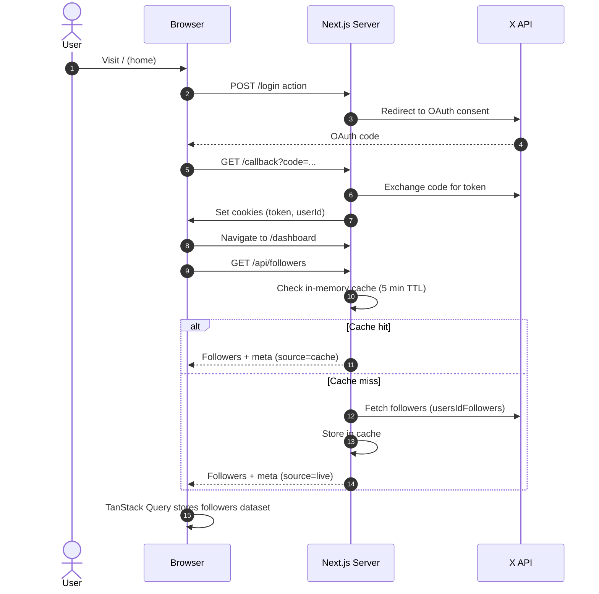
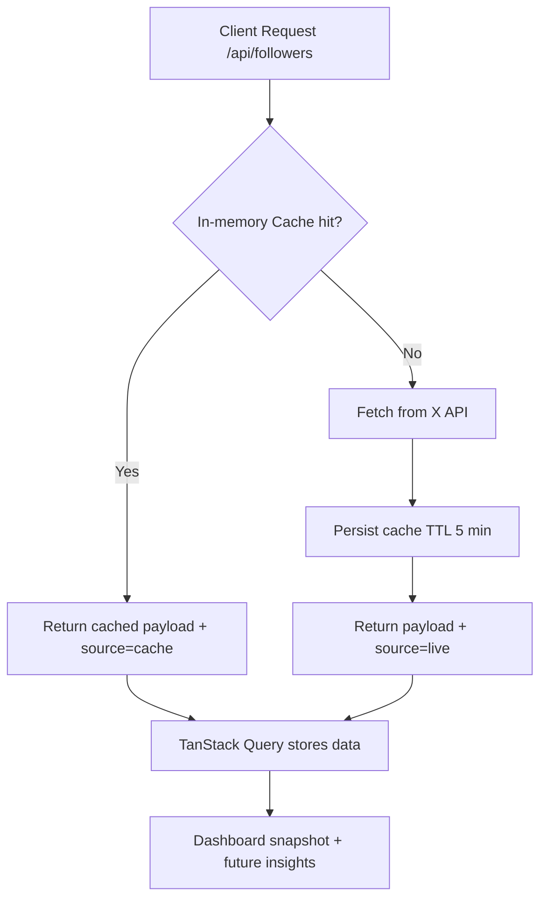

# Flow𝕏


Flow𝕏 helps you identify the X (Twitter) followers who most effectively amplify your reach, sustain engagement, and build your influence. This project provides a complete authentication and data pipeline, caching follower data to respect API rate limits. The dashboard offers a clean snapshot of your follower data, creating a reliable foundation for future features.

## Table of Contents

-   [Highlights](#highlights)
-   [Tech Stack](#tech-stack)
-   [System Overview](#system-overview)
-   [Folder Guide](#folder-guide)
-   [Getting Started](#getting-started)
-   [Caching Strategy](#caching-strategy)
-   [Developer Notes](#developer-notes)
-   [Future Ideas](#future-ideas)

## Highlights

-   **Secure Authentication**: Implements the official X OAuth 2.0 flow with refresh token support, using cookie-based storage for security.
-   **Efficient Data Ingestion**: A server-side process fetches follower data with a five-minute in-memory cache to prevent hitting rate limits.
-   **Responsive Dashboard**: Integrates with TanStack Query to make the follower dataset instantly available on the client, including metadata about cache freshness.
-   **Clear User Experience**: The home and dashboard pages are designed to clearly communicate the product's value.
-   **Modern UI**: Built with the Next.js App Router, Tailwind CSS, and Tabler Icons for a polished and consistent look.

## Tech Stack

-   [Next.js 14 App Router](https://nextjs.org/docs/app)
-   [React 18](https://react.dev) + [TypeScript](https://www.typescriptlang.org)
-   [@tanstack/react-query](https://tanstack.com/query/latest)
-   [twitter-api-sdk](https://github.com/twitterdev/twitter-api-typescript-sdk)
-   [Tailwind CSS](https://tailwindcss.com) & [Geist Mono](https://vercel.com/fonts/geist)
-   [Bun](https://bun.sh) (optional)

## System Overview



## Folder Guide

-   `app/layout.tsx`: Global layout, metadata, and font configuration.
-   `app/page.tsx`: The main landing page.
-   `app/callback/route.ts`: Handles the OAuth redirect and sets the token cookie.
-   `app/dashboard/page.tsx`: The main dashboard page that displays the follower snapshot.
-   `app/dashboard/followers-snapshot.tsx`: A client component that reads data from the TanStack Query cache.
-   `app/api/followers/route.ts`: The API endpoint for fetching follower data, with caching and token refresh logic.
-   `lib/twitter.ts`: Contains helper functions for OAuth, token management, and data fetching.

## Getting Started

1.  **Clone & Install**

    ```bash
    bun install # or npm install / pnpm install / yarn
    ```

2.  **Configure Environment**

    Copy the `.env.example` file to a new file named `.env.local` and add your X API credentials.

    ```bash
    X_CLIENT_ID="your client id"
    X_CLIENT_SECRET="your client secret"
    X_STATE_STRING="random-verifier"
    X_CODE_CHALLENGE="matching-challenge"
    ```

    You can get these credentials by registering an OAuth 2.0 app at the [X Developer Portal](https://developer.twitter.com/en/portal/dashboard). Set the redirect URL to `http://localhost:3000/callback`.

3.  **Run the Dev Server**

    ```bash
    bun dev # or npm run dev / pnpm dev / yarn dev
    ```

4.  **Browse the App**
    -   Home: http://localhost:3000
    -   Dashboard: http://localhost:3000/dashboard (requires login)
    -   Followers API: http://localhost:3000/api/followers (returns JSON)

## Caching Strategy



-   Cache entries are unique to each authenticated user and expire after five minutes.
-   API responses include metadata, so the client knows if the data is from the `live` API or the `cache`.
-   TanStack Query mirrors the server cache on the client, preventing redundant requests between components.

## Developer Notes

-   **Inspect Data**: You can inspect the cached data by opening the React Query Devtools or by running `queryClient.getQueryData(["followers"])` in your browser's console.
-   **Rate Limits**: The in-memory cache significantly reduces API calls. The system also automatically refreshes expired tokens.
-   **UI Polish**: The current dashboard is focused on data availability. Future work will involve adding more detailed visualizations and influence scoring.

## Future Ideas

-   Track follower influence scores over time.
-   Display reach and engagement trends on the dashboard.
-   Allow exporting insights for use in other tools.
-   Add notifications for when key followers engage with your content.

---

Maintained by [Satyam Vyas](https://github.com/SatyamVyas04). Contributions and ideas are always welcome!
